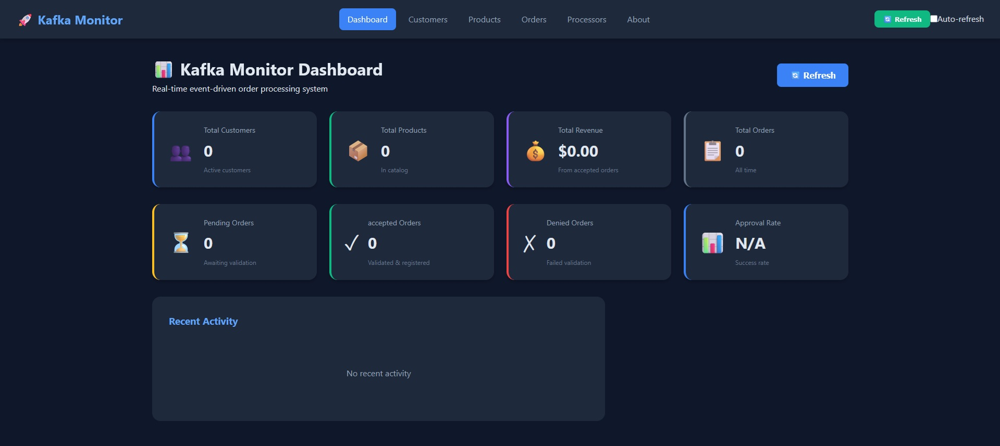
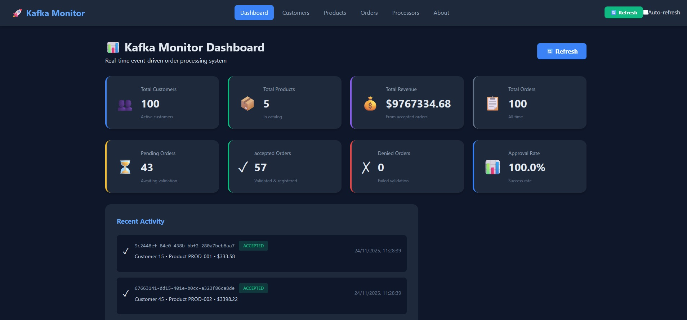
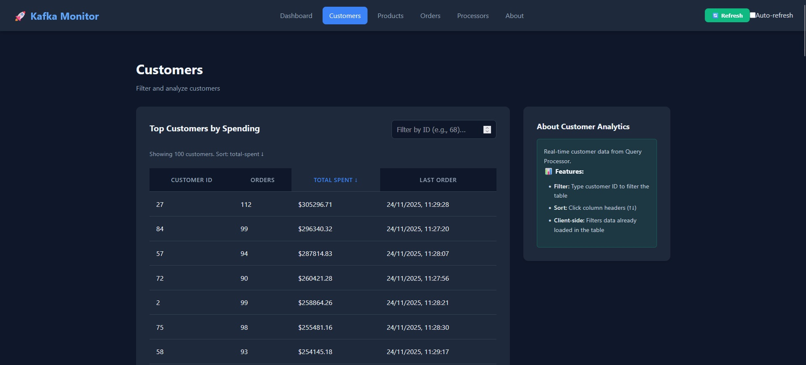
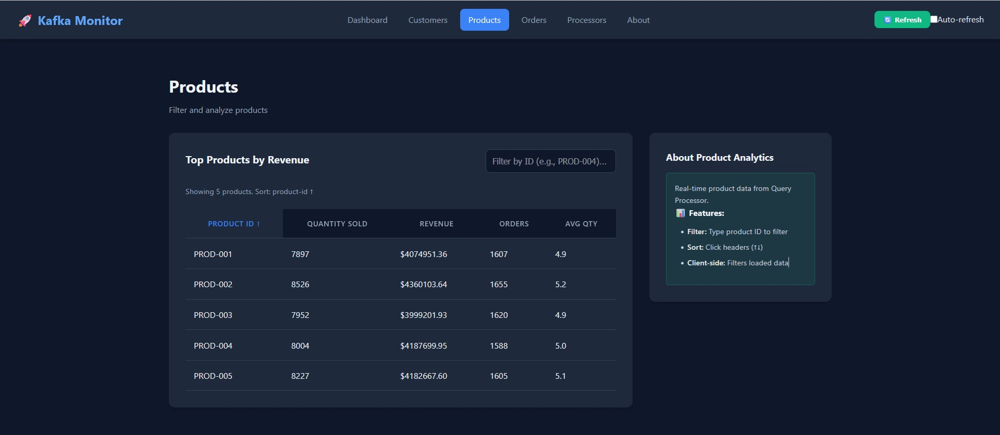
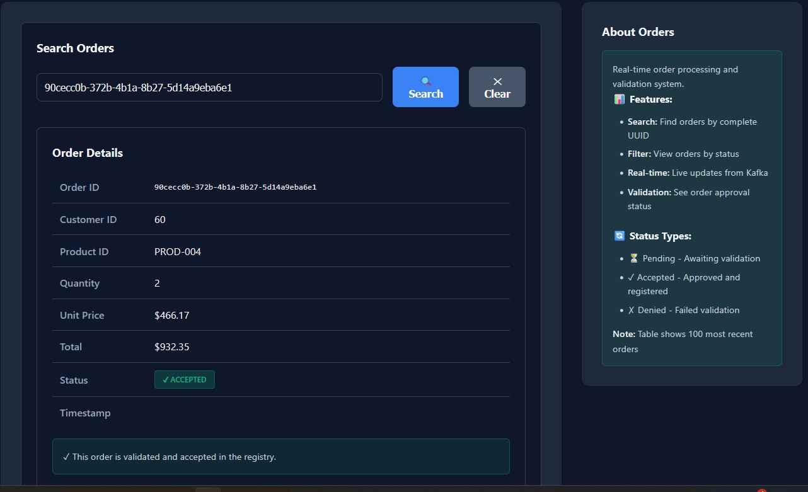

# 🚀 Kafka Monitor - Event-Driven Microservices System

A complete Kafka-based monitoring system demonstrating event-driven architecture with functional programming in Clojure.

## 📋 Architecture Overview

```
┌─────────────────┐
│ order-processor │ ──→ [orders topic]
└─────────────────┘          │
                             ↓
                    ┌────────┴────────┐
                    ↓                 ↓
           ┌───────────────┐ ┌──────────────┐
           │query-processor│ │registry-proc │
           │   (consumer)  │ │  (consumer+  │
           │               │ │   producer)  │
           └───────────────┘ └──────────────┘
                   ↓                 ↓
                   ↓            [registry topic]
                   ↓                 ↓
                   ↓         ┌──────────────┐
                   ↓         │registry-proc │
                   ↓         │  (consumer)  │
                   ↓         └──────────────┘
                   ↓                 ↓
                   └─────────────────┘
                            ↓
                      [Cassandra]
                 3 separate keyspaces
                            ↓
                     ┌─────────┐
                     │ monitor │ (API + Dashboard)
                     └─────────┘
```

## 🏗️ System Components

### 1. **order-processor**

- Produces random orders to `orders` topic
- Stores produced orders in Cassandra (`order_processor`)
- Configurable production rate

### 2. **query-processor**

- Consumes from `orders` topic
- Materializes views for fast queries:
  - Customer statistics (total orders, total spent)
  - Product statistics (quantity sold, revenue)
  - Timeline (last N orders)
- Stores views in Cassandra (`query_processor`)

### 3. **registry-processor**

- Consumes from `orders` topic
- Validates orders against business rules
- Produces accepted orders to `registry` topic
- Consumes from `registry` topic (its own output)
- Persists registered orders in Cassandra (`registry_processor`)

### 4. **monitor**

- HTTP API (Ring + Compojure)
- Dashboard (ClojureScript + Reagent) that polls Cassandra materialized views
- Read-only insights for customers, products, orders timeline
- Manual status override for pending orders (calls `PUT /api/orders/:id/status`)
- Client-side auto-refresh (polling) – no WebSocket streaming yet

## 🚀 Quick Start

### Prerequisites

- Docker & Docker Compose
- Leiningen (for local development)
- Java 17+

### 1. Start Infrastructure

```bash
# Start all services
docker-compose up -d

# Check status
docker-compose ps
```

All of them must be 'healthy'.

### 2. Initialize Kafka

```bash
# Make script executable (if needed)
chmod +x kafka.sh

# Create topics in Linux/MacOS
./kafka.sh setup

# Create topics in Windows
kafka.sh setup
```

### 3. Generate Test Data

```bash
# Generate 100 test orders in Linux/MacOS
./kafka.sh test-data 100

# Generate 100 test orders in Windows
kafka.sh test-data 100
```

#### Shell differences (scripts & permissions)

| Action / Script           | macOS / Linux command    | Windows PowerShell equivalent                                   |
| ------------------------- | ------------------------ | --------------------------------------------------------------- | --- |
| Make script executable    | `chmod +x kafka.sh`      | Not required (use `git config core.autocrlf false` to avoid CR) |
| Run helper script         | `./kafka.sh setup`       | `kafka.sh setup`                                                |     |
| Run lint/test shell files | `./lint.sh check`        | `lint.sh check`                                                 |
| Start docker-compose      | `docker-compose up -d`   | Same command                                                    |
| Stop docker-compose       | `docker-compose down` | Same command                                                    |

> Tip: On Windows, run PowerShell as Administrator the first time so scripts are allowed to execute, or use WSL for a closer Linux experience.

### 4. Access Services

| Service               | URL                       | Description                                   |
| --------------------- | ------------------------- | --------------------------------------------- |
| **Monitor Dashboard** | http://localhost:3000     | Read-only stats + order search (UI)           |
| Monitor API           | http://localhost:3000/api | REST API backed by Cassandra materializations |
| Kafka UI              | http://localhost:8080     | Kafka management                              |
| Cassandra Web         | http://localhost:3001     | Cassandra browser                             |

## 🌐 Dashboard Features


> The previous screenshot (`img/kafka-monitor-empty.png`) reflects the live dashboard right after bootstrap: stat cards and tables wait for Cassandra data.

### **Dashboard View**

- 📊 4 stat cards derived from `GET /api/stats` plus the timeline feed (Customers, Products, Accepted Revenue, Total Orders)
- 📋 “Recent Activity” list rendered from `GET /api/timeline` (up to the latest 100 orders)
- ✅ Approve/Deny buttons call `PUT /api/orders/:id/status` to override **pending** orders manually
- 🔄 Optional auto-refresh driven by polling (Re-frame interval); no streaming/WebSocket layer yet
- ⚠️ No embedded “system health monitoring” – everything displayed is computed from Cassandra materialized views

### **Orders View**

- **🔍 Order Search** – single form that calls `GET /api/orders/search/:id`, prioritizing `registered_orders` data and falling back to the timeline
- **📋 Recent Orders Table** – read-only feed (up to 100 entries) coming from the timeline, syncing status with `registered_orders` when present
- **⚠️ No manual creation** – there is no working `POST /api/orders` form; the `views.create-order` component is just a mock and remains hidden
- **ℹ️ Sidebar** – status meanings (pending/accepted/denied) and clarifies that the data set is read-only

### **Customers View**

- 📊 Client-side ranking built from `GET /api/customers/top?limit=100`
- 🔍 Local filter by customer ID for debugging convenience
- ⚠️ Backend search exists only via `GET /api/customers/:id`; the UI filter operates on the already-loaded ranking array

### **Products View**

- 📊 Client-side ranking sourced from `GET /api/products/top?limit=100`
- 🔎 Text filter by product-id prefix (case-insensitive)
- 📈 Sortable columns (quantity, revenue, order count, avg quantity)

### **Processors View**

- 📋 Static cards defined in `views.processors` describing each service
- `GET /api/processors/status` currently returns a hardcoded payload (all `"healthy"` with mock uptimes)
- ⚠️ Real metrics (processed count, lag, errors) are **not implemented yet** – keep documented as “Planned”

### **Auto-Refresh**

- 🔄 Polls every 5 seconds by default (toggleable)
- 🔃 Manual `Refresh` button dispatches `::events/fetch-all`
- ☑️ HTTP-only mechanism; there are no WebSockets or server-sent events yet

### 🚧 Planned / To-Be-Implemented

- `POST /api/orders` + Kafka producer on the monitor service to enable manual creation
- Real processor metrics (lag, throughput, errors) exposed through `/api/processors/status`
- Streaming/push channel (WebSocket or SSE) to replace the current polling loop
- “Create Order” view visible in the navbar once the endpoint exists

## 🖼️ UI Snapshots

| Screen                                   | Screenshot                                            |
| ---------------------------------------- | ----------------------------------------------------- |
| Dashboard waiting for ingestion          |        |
| Dashboard after data ingestion           |          |
| Customers ranking (Query Processor data) |          |
| Products ranking with local filters      |            |
| Orders search showing read-only details  |  |

> The previous image live under `img/` and are meant for onboarding decks when Cassandra is empty. They preserve the README’s redundant style while illustrating both empty and populated states of the materialized views.

## 📊 API Endpoints

### Query / Read endpoints (materialized views)

| Method | Path                                     | Backing store                                          | Notes                                                  |
| ------ | ---------------------------------------- | ------------------------------------------------------ | ------------------------------------------------------ |
| GET    | `/api/customers/:id`                     | `query_processor.orders_by_customer`                   | Per-customer totals and timestamps                     |
| GET    | `/api/customers/top?limit=10`            | same                                                   | Sorted by `total_spent` server-side                    |
| GET    | `/api/customers/search?q=68&limit=50`    | same                                                   | Returns `top` data or single customer if numeric query |
| GET    | `/api/products/:id`                      | `query_processor.orders_by_product`                    | Per-product aggregates                                 |
| GET    | `/api/products/top?limit=10`             | same                                                   | Revenue ranking                                        |
| GET    | `/api/products/search?q=PROD-0&limit=50` | same                                                   | Prefix filter performed in API                         |
| GET    | `/api/timeline?limit=100`                | `query_processor.orders_timeline` (+ registered merge) | Latest orders with registered status override          |
| GET    | `/api/orders`                            | `order_processor.orders`                               | Development helper: raw produced orders (limit 100)    |

### Registry data & order lookup

| Method | Path                                      | Description                                                              |
| ------ | ----------------------------------------- | ------------------------------------------------------------------------ |
| GET    | `/api/registered/:id`                     | Fetches a registered order (if any)                                      |
| GET    | `/api/orders/:id/history`                 | Returns `registry_processor.order_updates` history                       |
| GET    | `/api/orders/by-status/:status?limit=100` | Lists registered orders filtered by status                               |
| GET    | `/api/orders/search/:id`                  | Searches registered orders first, then timeline (validates UUID)         |
| GET    | `/api/debug/order/:id`                    | Returns booleans showing where the order exists (timeline vs registered) |

### Orders Management (current vs planned)

| Method | Path                     | Status         | Notes                                                                  |
| ------ | ------------------------ | -------------- | ---------------------------------------------------------------------- |
| PUT    | `/api/orders/:id/status` | ✅ Implemented | Manual override for pending orders; upserts into `registered_orders`   |
| POST   | `/api/orders`            | 🚧 Planned     | Returns HTTP 501 because monitor service does not publish to Kafka yet |

### System / ops endpoints

| Method | Path                     | Description                                                           |
| ------ | ------------------------ | --------------------------------------------------------------------- |
| GET    | `/api/stats`             | Aggregated counters (customers, products, registered counts, revenue) |
| GET    | `/api/processors/status` | Static mock payload marking all processors as healthy                 |
| GET    | `/api/health`            | Checks Cassandra connectivity                                         |

## 🛠️ Kafka Management

### Basic Operations on Linux/MacOS

```bash
# List topics
./kafka.sh list-topics

# Describe topic
./kafka.sh describe-topic orders

# List consumer groups
./kafka.sh list-groups

# Describe consumer group
./kafka.sh describe-group query-processor

# Show consumer lag
./kafka.sh show-lag
```

### Basic Operations in Windows

```bash
# List topics
kafka.sh list-topics

# Describe topic
kafka.sh describe-topic orders

# List consumer groups
kafka.sh list-groups

# Describe consumer group
kafka.sh describe-group query-processor

# Show consumer lag
kafka.sh show-lag
```

### Message Operations in Linux/MacOS

```bash
# Consume messages (from beginning)
./kafka.sh consume orders true

# Consume messages (from latest)
./kafka.sh consume orders

# Peek first 10 messages
./kafka.sh peek orders 10

# Produce test messages
./kafka.sh produce orders

# Count messages
./kafka.sh count orders

# Generate test data
./kafka.sh test-data 100
```

### Message Operations in Windows

```bash
# Consume messages (from beginning)
kafka.sh consume orders true

# Consume messages (from latest)
kafka.sh consume orders

# Peek first 10 messages
kafka.sh peek orders 10

# Produce test messages
kafka.sh produce orders

# Count messages
kafka.sh count orders

# Generate test data
kafka.sh test-data 100
```

### Consumer Group Management in Linux/MacOS

```bash
# Reset to earliest offset
./kafka.sh reset-group-earliest query-processor

# Reset to latest offset
./kafka.sh reset-group-latest query-processor

# Reset to specific timestamp
./kafka.sh reset-group-timestamp query-processor 2024-01-01T00:00:00

# Delete consumer group
./kafka.sh delete-group query-processor
```

### Consumer Group Management in Windows

```bash
# Reset to earliest offset
kafka.sh reset-group-earliest query-processor

# Reset to latest offset
kafka.sh reset-group-latest query-processor

# Reset to specific timestamp
kafka.sh reset-group-timestamp query-processor 2024-01-01T00:00:00

# Delete consumer group
kafka.sh delete-group query-processor
```

### Monitoring in Linux/MacOS

```bash
# Check broker health
./kafka.sh broker-health

# Show broker configuration
./kafka.sh broker-config

# Show topic configuration
./kafka.sh topic-config orders
```

### Monitoring in Windows

```bash
# Check broker health
kafka.sh broker-health

# Show broker configuration
kafka.sh broker-config

# Show topic configuration
kafka.sh topic-config orders
```

## 📦 Project Structure

```
kafka-monitor/
├── shared/                    # Shared code (specs, utils)
│   └── src/cljc/shared/
│       ├── specs.cljc        # Common specs
│       └── utils.cljc        # Utility functions
├── order-processor/           # Order generation service
│   ├── src/clj/order_processor/
│   ├── test/clj/order_processor/
│   ├── resources/
│   │   ├── config.edn
│   │   └── cassandra/schema.cql
│   ├── project.clj
│   └── Dockerfile
├── query-processor/           # Query view materializer
│   ├── src/clj/query_processor/
│   │   ├── model.clj         # Schemas
│   │   ├── aggregator.clj    # Pure aggregation logic
│   │   ├── db.clj            # Cassandra ops
│   │   ├── config.clj        # Configuration
│   │   ├── commands.clj      # Command system
│   │   └── core.clj          # Consumer loop
│   ├── test/clj/query_processor/
│   │   ├── model_test.clj
│   │   ├── functional_test.clj
│   │   ├── db_test.clj
│   │   ├── topology_test.clj
│   │   └── core_test.clj
│   ├── resources/
│   │   ├── config.edn
│   │   └── cassandra/schema.cql
│   ├── project.clj
│   └── Dockerfile
├── registry-processor/        # Validation & registration
│   ├── src/clj/registry_processor/
│   │   ├── model.clj
│   │   ├── validator.clj     # Business rules
│   │   ├── db.clj
│   │   ├── config.clj
│   │   ├── commands.clj
│   │   └── core.clj          # Consumer + Producer
│   ├── test/clj/registry_processor/
│   ├── resources/
│   │   ├── config.edn
│   │   └── cassandra/schema.cql
│   ├── project.clj
│   └── Dockerfile
├── monitor/                   # API + Dashboard (read-only + manual overrides)
│   ├── src/clj/monitor/
│   │   ├── server.clj        # Ring routes (13 endpoints)
│   │   ├── cassandra.clj     # DB queries
│   │   ├── config.clj
│   │   └── core.clj          # Main entry
│   ├── src/cljs/monitor/     # Dashboard polling materialized views
│   │   ├── components/
│   │   │   ├── cards.cljs    # Reusable cards
│   │   │   ├── forms.cljs    # Form components
│   │   │   └── table.cljs    # Table components
│   │   ├── views/
│   │   │   ├── dashboard.cljs
│   │   │   ├── orders.cljs   # Search + timeline
│   │   │   ├── customers.cljs
│   │   │   ├── products.cljs
│   │   │   └── processors.cljs
│   │   ├── core.cljs
│   │   ├── db.cljs
│   │   ├── events.cljs
│   │   ├── subs.cljs
│   │   └── views.cljs
│   ├── resources/
│   │   ├── config.edn
│   │   └── public/
│   │       ├── css/style.css  # Complete styles
│   │       └── index.html
│   ├── project.clj
│   └── Dockerfile
├── docker-compose.yml         # Orchestration
├── kafka.sh                   # Kafka management (24 commands)
└── README.md
```

## 🧪 Testing

### Running the tests

| Purpose                          | macOS/Linux      | Windows PowerShell |
| -------------------------------- | ---------------- | ------------------ |
| Lint + unit tests (all services) | `lein check-all` | same               |
| Clojure tests (all services)     | `lein test`      | same               |
| Full clean + tests               | `lein test-all`  | same               |
| Cloverage across services        | `lein coverage`  | same               |

### Service-specific commands

| Service                | Command                              |
| ---------------------- | ------------------------------------ |
| Order Processor        | `cd order-processor && lein test`    |
| Query Processor        | `cd query-processor && lein test`    |
| Registry Processor     | `cd registry-processor && lein test` |
| Monitor backend (Ring) | `cd monitor && lein test-backend`    |
| Shared lib             | `cd shared && lein test`             |
| All                    | `lein test-all`                      |

### Frontend (ClojureScript) tests

- Headless run (Node):  
  `cd monitor && lein test-cljs` (runs `cljsbuild once test` then executes `node target/test/test.js`)
- Compile-only (useful in CI):  
  `cd monitor && lein test-frontend`
- Watch mode during development (Figwheel):  
  `cd monitor && lein figwheel` (auto-runs tests defined via `day8.re-frame/test`)

### Coverage with Cloverage

- All services (root command): `lein coverage`  
  Outputs HTML/LCOV/Codecov reports under each `<service>/target/coverage`.
- Single service example: `cd query-processor && lein cloverage`

Minimum acceptable line coverage remains **80%** (enforced via `:fail-threshold 80` in each service’s `project.clj`).

### Test Types

- **Unit Tests**: pure functions (models, aggregator, validator)
- **Integration Tests**: Cassandra adapters (`db_test`)
- **E2E Tests**: Kafka topology pipelines (`topology_test`)
- **System Tests**: full command flow / consumer loops (`core_test`)

## 🎨 Code Quality

### Linting

```bash
# Check formatting and style
chmod +x lint.sh
./lint.sh check

# Auto-fix formatting issues
./lint.sh fix
```

### Tools Used

- **cljfmt**: Code formatting
- **kibit**: Style suggestions
- **eastwood**: Static analysis
- **bikeshed**: Code smell detection

### Pre-commit Hook

```bash
# Install pre-commit hook
chmod +x .git/hooks/pre-commit

# Now linting runs automatically before each commit
git commit -m "feat: add new feature"
```

## 🚀 Deployment

> This repository does **not** ship with a hosted deployment. The stack runs locally via Docker Compose by default. The options below are merely suggestions if you want to experiment with free tiers—adjust resource sizing, secrets, and infra hardening yourself.

#### Render.com (deploy without kafka and cassandra)

https://kafka-monitor.onrender.com/

## 🔄 CI/CD

### GitHub Actions

Automatically runs on every push:

1. ✅ Linting checks
2. ✅ Tests with coverage
3. ✅ Docker image builds
4. ✅ Deploy (if configured)

## 🔧 Development

### Local Development

```bash
# Start infrastructure only
docker-compose up -d kafka cassandra cassandra-migrations

# Run processor locally
cd query-processor
lein run

# Run with REPL
lein repl
```

#### Run each service without Docker

| Service                        | macOS / Linux                       | Windows PowerShell                        |
| ------------------------------ | ----------------------------------- | ----------------------------------------- |
| Order Processor                | `cd order-processor && lein run`    | `Push-Location order-processor; lein run` |
| Query Processor                | `cd query-processor && lein run`    | same                                      |
| Registry Processor             | `cd registry-processor && lein run` | same                                      |
| Monitor API + dashboard        | `cd monitor && lein run`            | same                                      |
| Shared REPL (spec experiments) | `cd shared && lein repl`            | same                                      |

> Equivalent root shortcuts: `lein run-order`, `lein run-query`, `lein run-registry`, `lein run-monitor`.

### Monitor Development

```bash
cd monitor

# Start figwheel (ClojureScript live reload)
lein figwheel

# Or build production
lein cljsbuild once min
```

## 📈 Monitoring

### View Metrics

- Kafka UI: http://localhost:8080
- Cassandra Web: http://localhost:3001
- Monitor Dashboard: http://localhost:3000

### Check Logs

```bash
# View all logs
docker-compose logs -f

# View specific service
docker-compose logs -f query-processor

# View last 100 lines
docker-compose logs --tail=100 registry-processor
```

## 🔐 Business Rules (Registry Processor)

Orders must pass ALL rules to be registered:

1. **Minimum Quantity**: >= 1
2. **Maximum Quantity**: <= 1000 (fraud prevention)
3. **Minimum Total**: >= $1.00
4. **Maximum Total**: <= $100,000 (fraud prevention)
5. **Price Consistency**: total ≈ quantity × unit_price (0.01 tolerance)
6. **Valid Status**: One of: pending, accepted, denied
7. **Valid Customer ID**: Must be positive integer
8. **Valid Product ID**: Must be non-empty string

> Source of truth: `registry-processor/src/clj/registry_processor/validator.clj`. Each rule is a pure reusable function registered in `validation-rules`.

## 📊 Database Schema

### Cassandra Keyspaces

#### 1. `order_processor`

```sql
-- Table: orders
CREATE TABLE orders (
    order_id UUID PRIMARY KEY,
    customer_id INT,
    product_id TEXT,
    quantity INT,
    unit_price DECIMAL,
    total DECIMAL,
    timestamp TIMESTAMP,
    status TEXT
);

-- Table: statistics
CREATE TABLE statistics (
    metric TEXT PRIMARY KEY,
    value COUNTER
);
```

#### 2. `query_processor`

```sql
-- Table: orders_by_customer
CREATE TABLE orders_by_customer (
    customer_id INT PRIMARY KEY,
    first_order_timestamp TIMESTAMP,
    last_order_id TEXT,
    last_order_timestamp TIMESTAMP,
    total_orders INT,
    total_spent DOUBLE
);

-- Table: orders_by_product
CREATE TABLE orders_by_product (
    product_id TEXT PRIMARY KEY,
    total_quantity INT,
    total_revenue DOUBLE,
    order_count INT,
    avg_quantity DOUBLE,
    last_order_timestamp TIMESTAMP
);

-- Table: orders_timeline
CREATE TABLE orders_timeline (
    bucket_id INT,
    timestamp TIMESTAMP,
    order_id TEXT,
    customer_id INT,
    product_id TEXT,
    quantity INT,
    unit_price DOUBLE,
    total DOUBLE,
    status TEXT,
    PRIMARY KEY (bucket_id, timestamp, order_id)
) WITH CLUSTERING ORDER BY (timestamp DESC);

-- Table: processing_stats
CREATE TABLE processing_stats (
    processor_id TEXT PRIMARY KEY,
    processed_count BIGINT,
    error_count BIGINT,
    last_processed_timestamp TIMESTAMP
);
```

> Note: `CREATE INDEX orders_timeline_order_id_idx ON orders_timeline (order_id)` is present to speed up ID lookups, exactly as defined in `database/schema-manager/migrations/003_create_query_processor_tables.cql`.

#### 3. `registry_processor`

```sql
-- Table: registered_orders
CREATE TABLE registered_orders (
    order_id TEXT PRIMARY KEY,
    customer_id INT,
    product_id TEXT,
    quantity INT,
    unit_price DOUBLE,
    total DOUBLE,
    status TEXT,
    registered_at TIMESTAMP,
    updated_at TIMESTAMP,
    version INT,
    validation_passed BOOLEAN
);

-- Table: order_updates
CREATE TABLE order_updates (
    order_id TEXT,
    version INT,
    previous_status TEXT,
    new_status TEXT,
    updated_at TIMESTAMP,
    update_reason TEXT,
    PRIMARY KEY (order_id, version)
) WITH CLUSTERING ORDER BY (version DESC);

-- Table: validation_stats
CREATE TABLE validation_stats (
    processor_id TEXT PRIMARY KEY,
    total_validated BIGINT,
    total_approved BIGINT,
    total_rejected BIGINT,
    timestamp TIMESTAMP
);
```

## 🎯 Key Features

### Functional Programming

- ✅ Pure functions (aggregator, validator)
- ✅ Immutable data structures
- ✅ Function composition
- ✅ Minimal Java interop

### Event-Driven Architecture

- ✅ Kafka topics for communication
- ✅ Consumer groups for scalability
- ✅ Idempotency (duplicate handling)
- ✅ Event sourcing patterns

### Microservices Patterns

- ✅ Independent deployment
- ✅ Separate databases (keyspaces)
- ✅ API gateway (monitor)
- ✅ Health checks

### Interactive Dashboard ✨ NEW

- ✅ **Search orders** by UUID (prioritizes registered orders)
- ✅ **Inspect the timeline** (last 100 orders)
- ✅ **Filter customers/products** using the rankings fetched from the Query Processor
- ✅ **Manual override** of pending order status via PUT
- ✅ **Configurable auto-refresh** based on polling
- ⚠️ **Processors view** shows only static cards (no realtime metrics)
- 🚫 **Order creation UI** is not implemented yet (mock hidden from navbar)

### Testing Strategy

- ✅ Unit tests (pure functions)
- ✅ Integration tests (DB with Testcontainers)
- ✅ E2E tests (Kafka embedded)
- ✅ Property-based testing (test.check)

## 🚨 Troubleshooting

### Kafka Issues

**Topics not created:**

```bash
## On Linux/MacOs
./kafka.sh setup

## On Windows
kafka.sh setup
```

**Consumer lag:**

```bash
## On Linux/MacOs
./kafka.sh show-lag
./kafka.sh describe-group query-processor

## On Windows
kafka.sh show-lag
kafka.sh describe-group query-processor
```

**Reset consumer:**

```bash
## On Linux/MacOs
./kafka.sh reset-group-earliest query-processor
# or
./kafka.sh reset-group-latest query-processor

## On Windows
kafka.sh reset-group-earliest query-processor
# or
kafka.sh reset-group-latest query-processor
```

### Cassandra Issues

**Connection failed:**

```bash
# Check if Cassandra is ready
docker-compose logs cassandra

# Wait for: "Starting listening for CQL clients"
docker exec -it kafka-monitor-cassandra cqlsh
```

**Schema not created:**

```bash
# Manually create schemas
docker exec -it kafka-monitor-cassandra cqlsh -f /docker-entrypoint-initdb.d/query/schema.cql
docker exec -it kafka-monitor-cassandra cqlsh -f /docker-entrypoint-initdb.d/registry/schema.cql
```

### Processor Issues

**Processor not consuming:**

```bash
# Check logs
docker-compose logs -f query-processor

# Check Kafka consumer group
## On Linux/MacOs
./kafka.sh describe-group query-processor

## On Windows
kafka.sh describe-group query-processor
# Restart processor
docker-compose restart query-processor
```

**No data in Cassandra:**

```bash
# Check if orders are being produced
## On Linux/MacOs
./kafka.sh consume orders true

## On Windows
kafka.sh consume orders true
# Check processor logs
docker-compose logs query-processor | grep "Order aggregated"
```

## 🔄 Common Workflows

### Reset Everything

```bash
# Stop all services
docker-compose down

# Remove volumes (deletes all data!)
docker-compose down -v

# Start fresh
## On Linux/MacOs
docker-compose up -d
./kafka.sh setup
./kafka.sh test-data 100

## On Windows
docker-compose up -d
kafka.sh setup
kafka.sh test-data 100
```

### Scale Processors

```bash
# Scale query processor to 3 instances
docker-compose up -d --scale query-processor=3

# Kafka will auto-rebalance partitions
## On Linux/MacOs
./kafka.sh describe-group query-processor

## On Windows
kafka.sh describe-group query-processor
```

### Monitor Performance

```bash
# Show consumer lag
## On Linux/MacOs
./kafka.sh show-lag

## On Windows
kafka.sh show-lag
# Check message count
## On Linux/MacOs
./kafka.sh count orders
./kafka.sh count registry

## On Windows
kafka.sh count orders
kafka.sh count registry
# View stats via API
curl http://localhost:3000/api/stats

# Check processors status
curl http://localhost:3000/api/processors/status
```

## 📚 Learning Resources

This project demonstrates:

1. **Clojure Fundamentals**

   - Pure functions
   - Immutable data structures
   - Threading macros (`->`, `->>`, `cond->`)
   - Spec validation

2. **Kafka Concepts**

   - Topics & partitions
   - Consumer groups
   - Offsets & commits
   - Producer/consumer patterns

3. **Cassandra Modeling**

   - Query-first design
   - Partition keys
   - Clustering columns
   - Materialized views (in-app)

4. **Microservices Architecture**

   - Service isolation
   - API gateway
   - Event-driven communication
   - Independent scaling

5. **ClojureScript + Reagent**
   - Component-based UI
   - Reactive state management
   - Forms and validation
   - Real-time updates

## 🤝 Contributing

### Code Style

- Follow Clojure style guide
- Use `lein cljfmt check` before committing
- Write docstrings for all public functions
- Add tests for new features

### Commit Messages

```
feat: Add customer ranking API endpoint
fix: Fix consumer offset commit timing
docs: Update API documentation
test: Add topology tests for registry processor
```

## 📝 License

MIT License - see [LICENSE](LICENSE)

## 🙏 Acknowledgments

Built with:

- Clojure & ClojureScript
- Apache Kafka
- Apache Cassandra
- Ring & Compojure
- Reagent & Re-frame

## 📞 Questions / Community

This is an educational demo and ships **without** official support or SLA. If you fork it and run into bugs:

- Open an [Issue](https://github.com/andre-rosas/kafka-monitor/issues) describing the scenario.
- Use [Discussions](https://github.com/andre-rosas/kafka-monitor/discussions) for architecture questions.
- The Wiki (when available) contains extra onboarding material.

---

**Happy Coding! 🚀**

Made with ❤️ and functional programming
